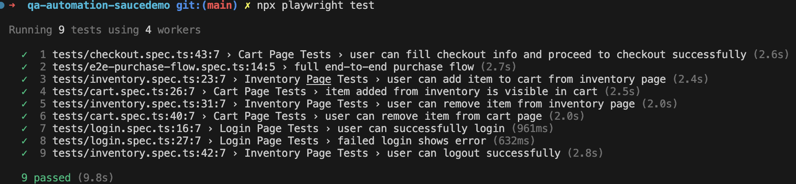

# QA Automation Project – Sauce Demo

## 📌 Overview

This project is an end-to-end test automation suite for the [Sauce Demo website](https://www.saucedemo.com/) using **Playwright** and **TypeScript**.

The goal is to demonstrate clean test design, maintainable code, and effective test coverage of critical user flows.

---

## 🧰 Tech Stack

- Playwright
- TypeScript
- Node.js

---

## 🚀 Setup Instructions

1. Clone the repository:

Using SSH:

```bash
git clone git@github.com:shazadn/qa-automation-saucedemo.git
```

Or using HTTPS:

```bash
git clone https://github.com/shazadn/qa-automation-saucedemo.git
```

Then navigate into the project:

```bash
cd qa-automation-saucedemo
```

2. Install dependencies:

```bash
npm install
```

3. Install Playwright browsers:

```bash
npx playwright install
```

---

## ▶️ Running Tests

Run all tests:

```bash
npx playwright test
```

Run tests in headed mode:

```bash
npx playwright test --headed
```

Run a specific test file:

```bash
npx playwright test tests/e2e/e2e-purchase-flow.spec.ts
```

---

## 🧪 Test Coverage

The following key user flows are automated:

- ✅ Login (successful & failed scenarios)
- ✅ Add item to cart
- ✅ Remove item (inventory & cart)
- ✅ Checkout flow (end-to-end)
- ✅ Logout

A full **end-to-end purchase flow** test is included to validate the core user journey.

---

## 🏗️ Project Structure

```
pages/
  LoginPage.ts
  InventoryPage.ts
  CartPage.ts
  CheckoutPage.ts

tests/
  login/
  inventory/
  cart/
  checkout/
  e2e/

utils/
  testData.ts
```

The project uses the **Page Object Model (POM)** to improve readability and maintainability.

---

## ✅ Testing Approach

- Tests are designed to be **independent and repeatable**
- App state is reset before tests to avoid flakiness
- Assertions validate both:
  - Navigation (URL)
  - UI elements (text, visibility, counts)

---

## 📌 To Do (If More Time Was Available)

If more time was available, the following additional scenarios and improvements would be automated:

### Additional Test Coverage

- Negative login scenarios (locked user, missing username/password)
- Checkout form validation (empty fields, invalid postal code)
- Adding/removing multiple items to the cart and verifying totals
- Verifying cart persistence across navigation and logout/login
- Verifying price totals and tax calculations on the checkout summary page
- Sorting products (price low-high, high-low, alphabetical)

### Automation Improvements

- Parameterised tests for multiple users and products, this will allow reuse of the same test logic but with different data inputs, improving coverage and reducing duplication of test code
- Test data is currently managed via reusable data objects. With more time, this could be extended using Playwright fixtures for better scalability and maintainability.
- Improved reporting using Playwright HTML reports

### CI / Pipeline Integration

- Running tests automatically in a CI pipeline (e.g. GitHub Actions)
- Adding test result artifacts and reports to CI runs

---

## 💡 Notes

- Focus was placed on **clean, maintainable code** rather than extensive coverage
- Selectors use `data-test` attributes where possible for stability
- Page Object Model is used to separate test logic from UI interactions

### ▶️ Test Results

All automated tests pass successfully:

